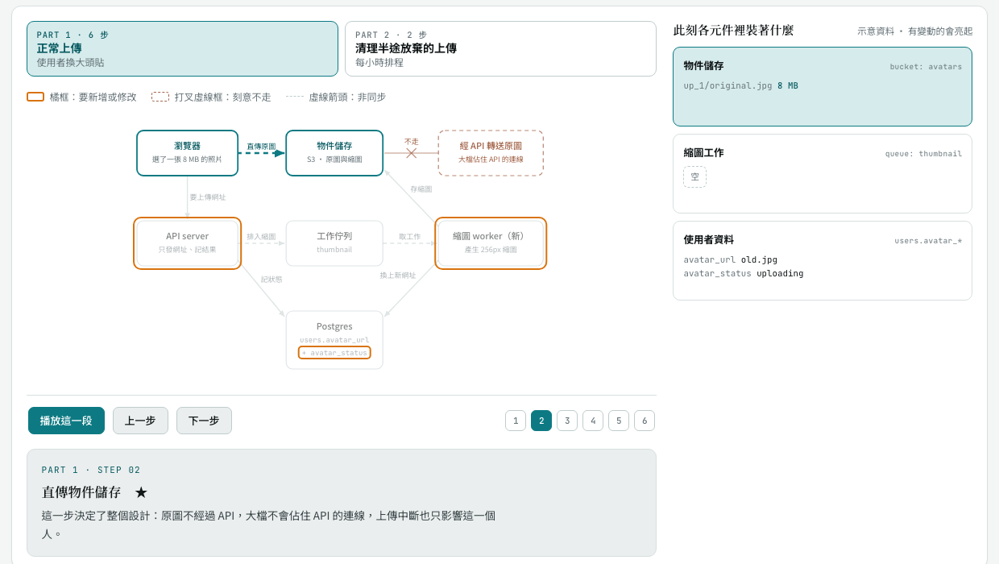
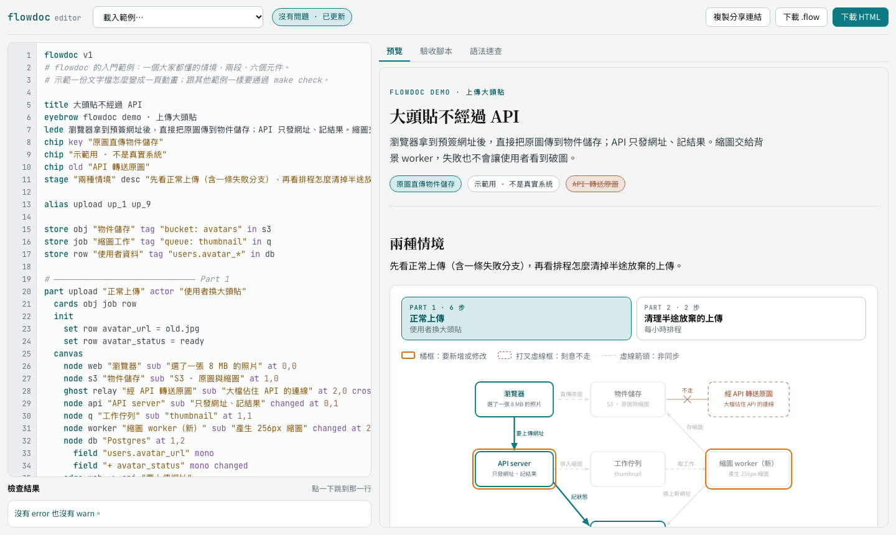

# flowdoc

用一份類似 mermaid 的 `.flow` 文字檔，產生**可播放的架構動畫頁**：依使用者行為分段，每段一張只畫用到元件的拓撲圖，逐步點亮連線，右側同步顯示各個 service 此刻裝著什麼。同一份 `.flow` 也能轉成 Gherkin `.feature` 當驗收腳本，而且兩邊一對一：改 `.feature` 可以轉回 `.flow`。

**線上試用：[editor](https://gpwork4u.github.io/flowdoc/) ・ [範例頁面](https://gpwork4u.github.io/flowdoc/examples/)**（GitHub Pages，不用安裝）

<picture>
  <source media="(prefers-color-scheme: dark)" srcset="docs/images/demo-dark.png">
  
</picture>

上圖是 [`examples/upload-avatar.flow`](examples/upload-avatar.flow)（約 100 行）產生的頁面。SVG 座標、連線端點、標籤位置、每一步每張卡的完整內容都是工具算的，沒有手寫 HTML。

## 最快的用法：瀏覽器 editor

打開 [線上 editor](https://gpwork4u.github.io/flowdoc/)，或下載 [`dist/flowdoc-editor.html`](dist/flowdoc-editor.html) 直接用瀏覽器打開（單一檔案、離線也能用）。左邊寫 `.flow`，右邊即時看到動畫；錯誤會標在行號上，點一下就跳到那一行。

<picture>
  <source media="(prefers-color-scheme: dark)" srcset="docs/images/editor-dark.png">
  
</picture>

- 打字停下來 0.2 秒就重新產生，預覽停在你原本看的那一步。
- 有 error 時預覽保留上一次成功的版本，不會整頁變空白。
- 「驗收腳本」分頁是產生的 `.feature`，也可以直接改，按「套用到 .flow」轉回左邊；「語法速查」列出所有關鍵字。
- 下載 `.flow`、HTML、`.feature`；「複製分享連結」把整份內容壓進網址，對方打開就看得到。
- 內容自動存在瀏覽器裡，關掉再打開還在。

細節見 [docs/editor.md](docs/editor.md)。

## 它解決什麼

跨服務的設計決定，用散文很難講清楚：「原圖不經過 API」讀三遍還是模糊，但看著圖上「瀏覽器 → 物件儲存」那條線亮起、右邊「物件儲存」那張卡多出 `8 MB`、API 那格始終沒亮，一次就懂。

手工做這種頁面的痛點是：SVG 座標全手寫、每一步每張卡都要寫完整內容、標籤常被框擋住、改一個元件要動好幾處。flowdoc 把它變成「寫 `.flow` → verify → render」。

- **一段一張圖**：每種使用者行為（上傳、刪除、backfill…）各自一張圖，只畫用到的元件。
- **三種顏色各有語意**：青色是「這一步正在發生」、褐色打叉虛線框是「刻意不走的路」、橘框是「要新增或修改的地方」。
- **狀態卡**：同一段內卡片內容自動帶到下一步，每一步只寫變動；失敗路徑用 `from` 分支。
- **四層驗證**：語法與參照、版面、輸出的 HTML、headless Chrome 截圖。每個問題都帶行號、代號與修法。
- **驗收腳本，一對一**：每條情境路徑轉成一個 Gherkin 場景，cucumber／godog／behave 都讀得懂；`.feature` 帶著 `.flow` 原文，改了場景、步驟、表格可以轉回 `.flow`，沒改就逐字相同。
- **純 JavaScript，沒有任何相依套件**：同一份核心在瀏覽器（editor）和 Node（CLI）裡跑，產生的頁面一模一樣。

## 命令列

| | 用途 | 沒有的話 |
|---|---|---|
| Node.js 20+ | CLI 與測試 | 只能用瀏覽器 editor |
| Google Chrome | `shot` 截圖與播放器檢查（E11）、editor 的端對端測試 | 印出「略過」；可用 `FLOWDOC_CHROME` 指定路徑 |

```bash
git clone https://github.com/gpwork4u/flowdoc.git
cd flowdoc
make check        # 跑一次全部檢查，確認環境沒問題
```

不需要 `npm install`：沒有任何相依套件。

```bash
# 1. 從入門範例產生一份起點
node bin/flowdoc.js init mydoc.flow

# 2. 改成你的設計後檢查：語法、參照、版面
node bin/flowdoc.js verify mydoc.flow

# 3. 產生頁面，再檢查輸出的 HTML
node bin/flowdoc.js render mydoc.flow -o mydoc.html
node bin/flowdoc.js verify mydoc.html

# 4. 每段截圖，自己看一次（也會確認播放器真的跑起來）
node bin/flowdoc.js shot mydoc.html --out shots/

# 5.（選用）產生驗收腳本；改過的 .feature 可以轉回 .flow
node bin/flowdoc.js gherkin mydoc.flow -o mydoc.feature
node bin/flowdoc.js flow mydoc.feature -o mydoc.flow

# 產生一份 editor（單一 HTML 檔）
node bin/flowdoc.js editor -o editor.html
```

用瀏覽器打開 `mydoc.html` 就能播放。要放到靜態站（例如 GitLab Pages）用 `render --standalone`；要發佈成 claude.ai artifact 用預設輸出。網址加 `#p2s3` 會直接開到第 2 段第 3 步。

寫錯時，verify 會指出行號與修法：

```text
mydoc.flow:36: warn  W1 edge web->s3 從未被任何步驟點亮：不需要就刪掉，需要就加進某個 step 的 on
mydoc.flow:47: error E2 step「直傳物件儲存」點亮了不存在的元件或連線 web->s4。連線 id 預設是 <從>-><到>，inner 是 <pod>.<inner>。是不是 web->s3？
mydoc.flow: 1 error · 1 warn
```

## 一段 `.flow` 長什麼樣

```text
part upload "正常上傳" actor "使用者換大頭貼"
  cards obj job row
  canvas
    node web "瀏覽器" sub "選了一張 8 MB 的照片" at 0,0
    node s3 "物件儲存" sub "S3 · 原圖與縮圖" at 1,0
    ghost relay "經 API 轉送原圖" sub "大檔佔住 API 的連線" at 2,0 cross s3 "不走"
    node api "API server" sub "只發網址、記結果" changed at 0,1
    edge web -> api "要上傳網址"
    edge web -> s3 "直傳原圖" key
  step "直傳物件儲存" key
    on web->s3
    desc 這一步決定了整個設計：原圖不經過 API，大檔不會佔住 API 的連線。
    set obj up_1/original.jpg = 8 MB !hl
```

元件用 `at <欄>,<列>` 放在格線上，`on` 列出這一步要點亮的連線（兩端的元件與標籤會一起亮），`set` 只寫這一步的變化。完整寫法見 [教學](docs/tutorial.md) 與 [格式規格](skill/references/format.md)。

## `.flow` ↔ `.feature`

`gherkin` 把每條情境路徑轉成一個場景，每一步一個「當」，有變動的卡變成「那麼」的表格；`.flow` 的每一行原文以 `#@` 註解跟著放進去（runner 會忽略）：

```gherkin
    #@   step "直傳物件儲存" key
    #@     on web->s3
    #@     desc 這一步決定了整個設計：原圖不經過 API，……
    #@     set obj up_1/original.jpg = 8 MB !hl
    # ★ 分歧點
    當 直傳物件儲存
      # 經過：瀏覽器 → 物件儲存（直傳原圖）
    那麼 物件儲存 的「物件儲存」應該是：
      | key               | value |
      | up_1/original.jpg | 8 MB  |
```

改了「當」的標題、「結果應該是」、表格裡的值、「最終」，或多加一個「當」，`flow` 會改寫對應的 `.flow` 行並列出每一處修改；沒改的地方逐字保留。對應不到的修改（例如改了分支場景開頭照抄的前置步驟）會給 W9，不會默默丟掉。規則見 [驗收腳本](skill/references/gherkin.md)。

## 範例

| 檔案 | 內容 | 示範的功能 |
|---|---|---|
| [`upload-avatar.flow`](examples/upload-avatar.flow) | 上傳大頭貼：直傳物件儲存、背景縮圖、清理半途放棄的上傳 | 入門。★、橘框、ghost、非同步、`from` 分支、`fault`／`expect`／`note` |
| [`catalog-search-sync.flow`](examples/catalog-search-sync.flow) | 商品資料同步到搜尋索引，五種情境：上架、發佈變更、下架、backfill、後續查詢 | pod 與 inner、平行連線（`as`）、`eventually`、故障分支、code／table／decisions／footer |
| [`doc-search-acl.flow`](examples/doc-search-acl.flow) | 權限在查詢時算出、不寫進向量庫的文件搜尋 | 兩個 ghost、雙行標籤、`from 0`、`qa`、舊做法欄 |

三份都是虛構的範例系統，可以在 editor 的「載入範例」裡打開，或看 [線上的範例頁面](https://gpwork4u.github.io/flowdoc/examples/)。

## 文件

| 文件 | 內容 |
|---|---|
| [瀏覽器 editor](docs/editor.md) | 功能、鍵盤操作、分享連結、發佈成 artifact、限制 |
| [教學：從零寫一份 `.flow`](docs/tutorial.md) | 以上傳大頭貼為例，一步步寫完、驗證、發佈 |
| [指令參考](docs/cli.md) | `init`／`render`／`verify`／`shot`／`gherkin`／`flow`／`editor` 的參數、輸出與 exit code |
| [當成 Claude Code skill 使用](docs/claude-code-skill.md) | 安裝、觸發方式、Claude 會照什麼流程做 |
| [格式規格](skill/references/format.md) | `.flow` 的完整語法（唯一來源） |
| [設計規則](skill/references/design-rules.md) | 版面、顏色、文字、內容的規則 |
| [驗證規格](skill/references/verification.md) | E1–E12、W1–W9 每個代號的意義 |
| [驗收腳本](skill/references/gherkin.md) | `.flow` ↔ `.feature` 的對應規則、轉回去時怎麼改、step definition 的約定 |
| [輸出契約](skill/references/output.md) | 產生的 HTML 結構，改 renderer 或 runtime 時看 |

## 當成 Claude Code skill 使用

```bash
ln -s "$PWD/skill" ~/.claude/skills/flowdoc
node ~/.claude/skills/flowdoc/scripts/flowdoc.mjs verify examples/upload-avatar.flow   # 在任何目錄都能跑
```

之後在 Claude Code 說「把這份設計做成可播放的流程圖」或「用 flowdoc 畫…」，Claude 會照 [`skill/SKILL.md`](skill/SKILL.md) 的流程：先讀程式蒐集拓撲、寫 `.flow`、驗證到通過、截圖檢查、發佈成 artifact。細節見 [docs/claude-code-skill.md](docs/claude-code-skill.md)。

skill 要用 symlink 安裝，`scripts/flowdoc.mjs` 會跟著 symlink 找到這個 repo；單獨複製 `skill/` 出去會找不到程式。

## 專案結構

```text
.flow ──parse──▶ 文件模型 ──layout──▶ 座標 ──render──▶ HTML（page.css + runtime.js + flow-data JSON）
                    │   │               │                 │
                    │ verify 第一層    verify 第二層      verify 第三層 ／ shot 第四層
                    │
                    └──gherkin──▶ .feature（驗收腳本，帶 #@ 原文）──flow──▶ .flow
```

| 路徑 | 內容 |
|---|---|
| `src/` | 核心（瀏覽器與 Node 共用）：`parse` → `state`（carry-over 與分支）→ `layout` → `render`；`verify`、`gherkin`（.flow → .feature）、`roundtrip`（.feature → .flow） |
| `src/node/` | 只在 Node 用的部分：CLI、截圖、讀檔、內嵌 JS 的語法檢查、editor 打包、GitHub Pages 的內容（`site.js`） |
| `editor/` | 瀏覽器 editor 的原始碼（HTML 樣板、CSS、JS、語法速查） |
| `dist/flowdoc-editor.html` | 打包好的 editor，直接打開就能用 |
| `skill/` | Claude Code skill：`SKILL.md`、規格文件、共用的 `page.css` 與 `runtime.js`、CLI 入口 `scripts/flowdoc.mjs` |
| `examples/` | `.flow` 範例 |
| `test/` | `node --test`；`fixtures/bad-*.flow` 每個錯誤代號至少一個 |
| `bin/flowdoc.js` | CLI |
| `docs/` | 使用文件與圖片 |
| `.github/workflows/` | `ci.yml` 跑 `make check`；`pages.yml` 把 `make site` 的內容部署到 GitHub Pages |

## 開發

```bash
make check    # 範例 render（含 .feature）+ verify（含 .feature 轉回 .flow）+ 重新打包 editor + 測試（含 editor 端對端）+ 截圖與播放器檢查
make site     # 產生 GitHub Pages 的內容到 _site/
make clean    # 刪掉 out/ 與 _site/
```

- 完成任何變更前跑 `make check`，`EXIT=0` 才算完成。`dist/flowdoc-editor.html` 會跟著重新產生，要一起 commit。
- 核心模組（`src/` 底下，不含 `src/node/`）不能用 `node:*`，只用具名 import／export：editor 的打包器靠這個規則。
- 改格式時，同一個 commit 內更新 `skill/references/format.md`、parser、範例與測試。
- `skill/assets/page.css` 與 `runtime.js` 是所有輸出頁面共用的，不放任何文件內容。

接手開發的脈絡與待辦見 [`HANDOFF.md`](HANDOFF.md)。

## 目前狀態

- 動畫頁、四層驗證、`.flow` ↔ `.feature` 互轉、瀏覽器 editor 都可用，三份範例全部通過檢查。
- 0.2 版從 Python 改寫成 JavaScript：改寫時兩邊對同一批 `.flow`（範例、29 個錯誤 fixture、270 份隨機變形的版本）跑過，輸出的 HTML、驗證訊息、驗收腳本逐字相同。
- 互轉對範例、fixture 與上千份隨機修改測過（沒改時逐字相同、改過的轉回後再來回一次不變）。驗收腳本還沒在真實專案裡實作 step definition、實際跑過。
- 只讀 `.flow`，還不能直接匯入 mermaid。
