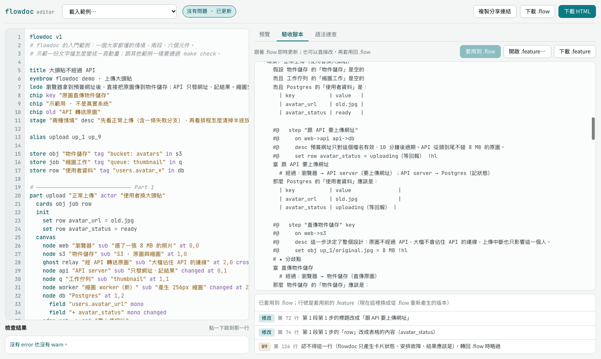

# 瀏覽器 editor

一個 HTML 檔就是完整的 flowdoc：parser、排版、render、驗證、驗收腳本（含轉回 `.flow`）全部內嵌，和命令列用的是同一份程式碼，產生的頁面逐字相同。不需要安裝、不需要伺服器，`file://` 也能用。

## 打開

| 方式 | 怎麼做 |
|---|---|
| 線上 | [gpwork4u.github.io/flowdoc](https://gpwork4u.github.io/flowdoc/)（GitHub Pages，master 更新後自動部署） |
| 直接打開 | 用瀏覽器開 repo 裡的 [`dist/flowdoc-editor.html`](../dist/flowdoc-editor.html) |
| 自己產生 | `node bin/flowdoc.js editor -o editor.html` |
| 發佈成 claude.ai artifact | `node bin/flowdoc.js editor --fragment -o editor.html`，再發佈這個檔（artifact 會補上頁首） |

需要支援 ES2022 的瀏覽器（Chrome、Edge、Safari、Firefox 近兩年的版本）。字型從 Google Fonts 載入，離線時改用系統字型，不影響功能。

## 畫面

```text
┌ flowdoc editor ─ [載入範例…] ─ (狀態) ───────── [複製分享連結] [下載 .flow] [下載 HTML] ┐
│ 行號 │ .flow 原始檔（上色）         │ 預覽 ／ 驗收腳本 ／ 語法速查                      │
│      │                               │                                                  │
│      │                               │   即時產生的動畫頁                               │
├──────┴───────────────────────────────┤                                                  │
│ 檢查結果（點一下跳到那一行）          │                                                  │
└───────────────────────────────────────┴──────────────────────────────────────────────────┘
```

窄螢幕上，編輯區在上、預覽在下。

## 即時預覽

- 打字停下來 0.2 秒就重新 parse、驗證、render。預覽用兩個 iframe 輪流載入，換頁時不會閃白。
- **停在原本那一步**：你在預覽裡點到第 2 段第 3 步，改完字之後預覽還是第 2 段第 3 步，捲動位置也保留。
- **有 error 時保留上一次的預覽**：頂端會出現「有 error，預覽停在上一次成功的版本」，修好之後自動更新。warn 不擋預覽。
- 狀態列顯示目前的 `N error · M warn`；沒有問題時是「沒有問題 · 已更新」。

## 檢查結果

和命令列 `verify` 的第一、二層相同（E1–E6、W1–W8），每一項都帶代號、行號與修法。

- 點一下就跳到那一行並選取整行。
- 有 error 的行號標紅、warn 標橘，原始檔那一行也會加底色。
- 第三層（輸出的 HTML）與第四層（截圖）只在命令列跑：editor 產生的 HTML 和命令列一樣，這兩層由 `make check` 保證。

## 編輯

| 按鍵 | 作用 |
|---|---|
| Tab | 插入兩個空白；選了多行時整段縮排 |
| Shift+Tab | 整段減少一層縮排 |
| Enter | 換行並保留目前的縮排 |
| ⌘S／Ctrl+S | 下載 `.flow` |
| ⌘Z／Ctrl+Z | 復原（包括「載入範例」，載入前的內容可以復原回來） |

上色規則：頂層與段落裡的關鍵字（`part`、`node`、`step`…）、修飾字（`key`、`async`、`changed`…）、字串、`->`、座標、`#` 註解、`|` 程式碼行各有顏色。

## 驗收腳本：改 `.feature` 再套用回 `.flow`

「驗收腳本」分頁是 `gherkin` 產生的 `.feature`，平常跟著左邊的 `.flow` 即時更新。它也是一個編輯區：

1. 直接改場景名稱、「當」的標題、「結果應該是」、表格裡的值、「最終」，或多加一個「當」。改了之後上方顯示「有還沒套用的修改」，這時左邊的 `.flow` 再怎麼改也不會覆蓋這裡。
2. 按 **套用到 .flow**：轉回 `.flow` 取代左邊的內容（⌘Z／Ctrl+Z 可以復原），下面列出每一處修改與 W9；點一下跳到 `.feature` 的那一行。有 error（E12 或轉出的 `.flow` 有 error）時不套用。
3. 不要了就按 **捨棄修改**，回到 `.flow` 產生的版本。



**開啟 .feature…** 讀進本機的 `.feature`（例如別人改過寄回來的），直接套用。哪些修改轉得回去、哪些會得到 W9，見 [驗收腳本](../skill/references/gherkin.md)「轉回 .flow」。

## 範例、分享、下載

- **載入範例**：入門範例（上傳大頭貼）、商品搜尋同步、文件搜尋權限（都是虛構的範例系統）。目前的內容會被取代，按 ⌘Z／Ctrl+Z 可以復原。
- **自動保存**：內容存在這個瀏覽器的 localStorage，關掉再打開還在。換一台電腦或換瀏覽器就看不到，要保留請下載 `.flow`。
- **複製分享連結**：把整份內容用 deflate 壓縮後放進網址的 `#src=…`，對方打開就看到同一份內容；網址不會送到任何伺服器。內容很長時網址也會很長，這時改傳 `.flow` 檔比較穩。
- **下載**：`.flow`、HTML（完整文件，可以直接放到靜態站）、`.feature`（在「驗收腳本」分頁；下載的是分頁裡目前的內容，包括還沒套用的修改）。在不允許下載的環境（例如 claude.ai artifact 裡），下載後的提示有「改為複製」可以用。

## 開啟順序

editor 打開時依序找內容：

1. 網址的 `#src=…`（分享連結）
2. 這個瀏覽器存的草稿
3. 入門範例

## 怎麼做出來的

- `src/` 的核心模組只用標準 JavaScript，不碰 `node:*`，所以瀏覽器和 Node 共用。
- `src/node/build-editor.js` 把核心模組（含轉回 `.flow` 的 `roundtrip.js`）、`editor/` 的程式與樣式、`skill/assets/` 的 `page.css` 與 `runtime.js`、三份範例打包成一個 HTML 檔：每個模組包成立即執行的函式，`import`／`export` 換成區域變數。
- 預覽是 `render --standalone` 的輸出，放進 `srcdoc` iframe。播放器每換一步就用 `postMessage` 回報位置，editor 重新產生時在 runtime 之前設定 `window.name`（例如 `p2s3`），播放器就從那一步開始。
- `test/editor.test.js` 確認打包後的核心和 Node 版產生一模一樣的頁面；`test/editor.e2e.test.js` 用 headless Chrome 實際操作 editor：改字、停在同一步、打錯 id、點錯誤跳行、修好、改驗收腳本再套用回 `.flow`、載入範例。

## 限制

- 不是完整的程式碼編輯器：沒有自動補完、沒有多游標、沒有搜尋取代（用瀏覽器的頁內搜尋）。
- 很長的文件（上千行）每次輸入都會整份重新上色與產生，打字可能會有一點延遲。
- 截圖（第四層）要用命令列的 `shot`。
- 發佈成 claude.ai artifact 時：
  - 下載走 artifact 的 `downloads` 能力，會先請你確認；發佈時要宣告 `capabilities: {downloads: true}`。artifact 只允許部分副檔名，HTML 照常存，`.flow` 與 `.feature` 會存成 `.flow.txt`、`.feature.txt`，拿掉結尾的 `.txt` 就是原本的檔案。不能下載的環境會改提供「改為複製」。
  - 網址的 `#src=…` 不會傳進頁面，所以分享連結只在直接打開檔案或放在一般網站上時有用。
